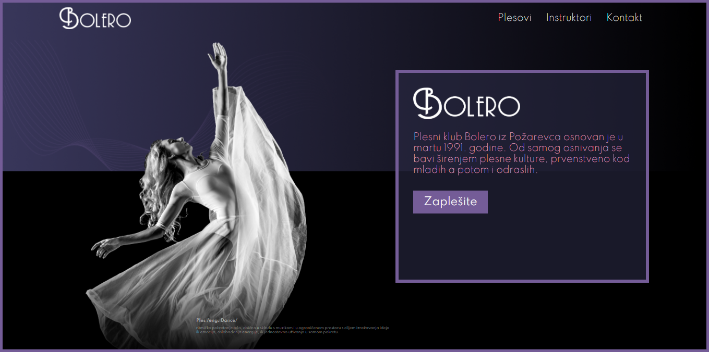

<a href="http://fortesting.rf.gd/"><h1>Bolero Dance Club</h1></a>
<h2>Project Overview</h2>

The project represents a website created for the <a href="https://www.facebook.com/pkbolero/">Bolero Dance Club</a>. The website was not done for commision and was just used for practise. The club itself just served as a theme.

 

<h2>Design</h2>

The colors that were chosen are there to present style and elegance and that the dance club itself is a very classy one.

<ul>
    <li>Dark Purple(#39375A)</li>
    <li>Light Purple(#745C97)</li>
    <li>Black(#000000)</li>
    <li>White(#ffffff)</li>
</ul>

The Figma design can be found <a href="https://www.figma.com/file/dPWCb4mpW9WU8tHakSyoW5/Bolero-Dance-Club?node-id=0%3A1">here</a>.

<h2>Technologies</h2>

For this project the following tecnologies were used:

<ul>
    <li>
HTML - Used to create the markup of the page.

    </li>
        <li>
SASS/CSS - Sass was used in order to streamline and simplify the styling of the page.

    </li>
        </li>
        <li>
ReactJS - This framework was useful to more easily create sections and components of the website.

    </li>
</ul>
